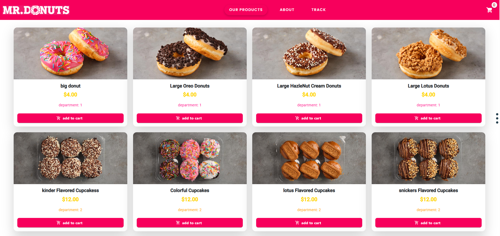

# Mr. Donuts - חנות דונאטס דיגיטלית 🍩

ממשק חנות מודרני, צבעוני ואינטראקטיבי המציג קטלוג מוצרים בצורה אסתטית ונוחה למשתמש.

---

---

## 🔗 קישורים מהירים
* **צפו באתר החי (Netlify):** [https://mr-donuts-app.netlify.app/products](https://mr-donuts-app.netlify.app/products)
* **קוד מקור בגיטהאב:** [https://github.com/shiffi-weingarten/mr-donuts-store](https://github.com/shiffi-weingarten/mr-donuts-store)

---

## 📝 אודות הפרויקט
הפרויקט **Mr. Donuts** הוא אפליקציית Frontend המדגימה בניית קטלוג מוצרים דינמי. המערכת מאפשרת למשתמשים לחקור מגוון דונאטס, לצפות בפרטים ומחירים, וליהנות מחוויית גלישה רספונסיבית המותאמת לכל מכשיר.

## ✨ תכונות עיקריות
* **תצוגת מוצרים דינמית:** הצגת נתונים בזמן אמת עם תמונות ותיאורים.
* **עיצוב רספונסיבי מלא:** האתר נראה מצוין במחשב, בטאבלט ובסמארטפון.
* **חווית משתמש (UX):** מעברי דפים מהירים וממשק נקי ומזמין.
* **אופטימיזציה:** שימוש בטכנולוגיות צד לקוח מתקדמות לביצועים מהירים.

## 🛠 טכנולוגיות שבהן השתמשתי
* **JavaScript / React / Vue** (עדכני לפי הטכנולוגיה שבחרת).
* **CSS3 / HTML5** - עיצוב מותאם אישית (Custom Styling).
* **Netlify** - לאחסון ופריסה אוטומטית (CI/CD).
* **Git & GitHub** - לניהול גרסאות.

---

### 👩‍💻 פותח על ידי:
**שפי וינגרטן** - סטודנטית להנדסת תוכנה.

